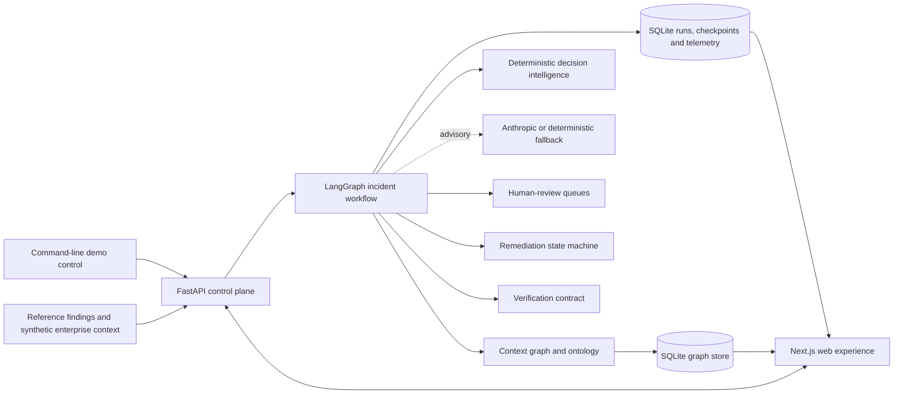
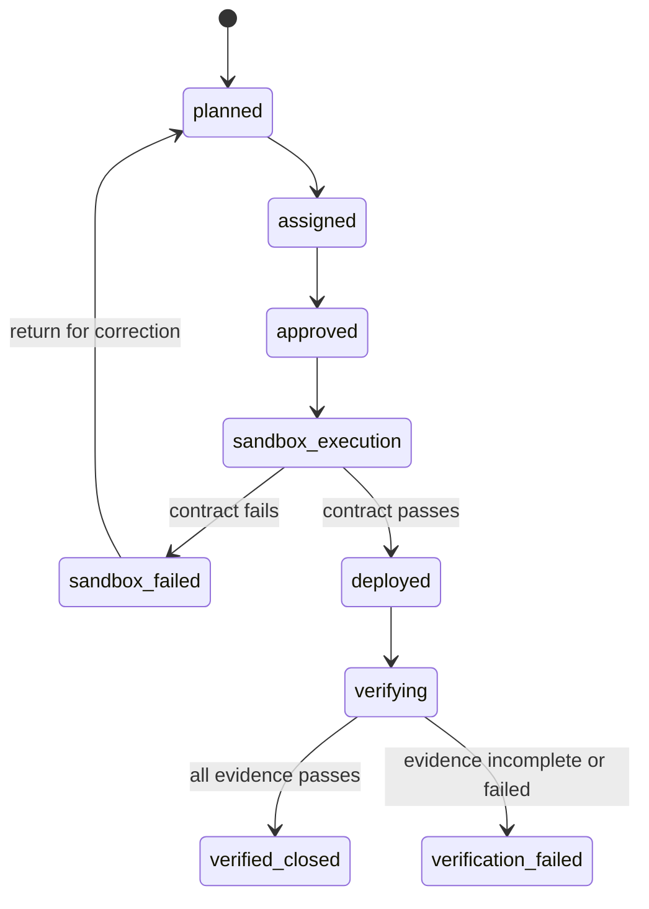
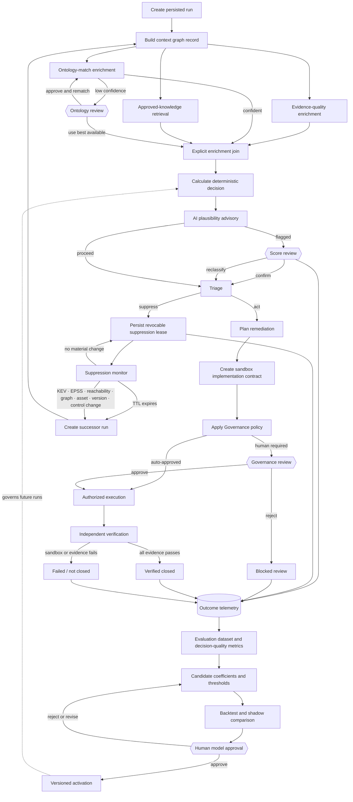
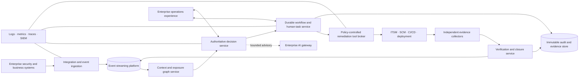

# Governed CTEM Decision & Control Plane

## Technical Architecture Design

**Document status:** Implemented demo baseline with productionization target  
**Last updated:** July 14, 2026  
**Intended audience:** Security architecture, enterprise architecture, platform engineering, application security, vulnerability management, AI governance, and operations

---

## 1. Executive summary

The implemented system is a working vertical slice of a governed Continuous Threat Exposure Management (CTEM) decision and control plane. It converts vulnerability findings into contextualized, versioned, explainable risk decisions; applies explicit policy; routes uncertainty and consequential actions through persisted human-review gates; manages a remediation state machine; and requires evidence before declaring verified closure.

The architecture deliberately separates four kinds of authority:

1. **Deterministic authority** owns scoring, tier calculation, policy overrides, workflow transitions, and closure rules.
2. **AI advisory** supplies bounded narratives, plausibility review, remediation assistance, and test suggestions. It cannot silently change an authoritative outcome.
3. **Human authority** resolves ontology, score, and execution-authorization decisions through checkpointed review gates.
4. **Evidence authority** determines closure through an explicit four-artifact verification contract.

The current implementation is optimized for a reliable local demonstration. It uses FastAPI, LangGraph, SQLite, a Next.js user interface, synthetic enterprise context, visibly simulated adapters, and optional live Anthropic reasoning. It is not represented as a production deployment.

Productionization retains these authority boundaries while replacing local persistence, in-process execution, simulated adapters, and open local access with durable workflow orchestration, managed data services, enterprise identity, event-driven integration, controlled execution, independent evidence, observability, resilience, and security controls.

---

## 2. Goals and non-goals

### 2.1 Implemented goals

- Demonstrate one traceable flow from finding ingestion to verified exposure reduction.
- Correlate vulnerability signals with services, software, owners, dependencies, reachability, and business criticality.
- Apply a versioned deterministic risk model.
- Retain calculated disposition separately from final policy disposition.
- Express CISA KEV escalation as an explicit, auditable policy override.
- Identify missing, inferred, stale, present, and simulated evidence.
- Bound generative AI to advisory functions.
- Pause and resume workflows at meaningful human-review boundaries.
- Persist remediation state, actor provenance, and transition history.
- Prevent closure unless the required verification contract is satisfied.
- Clearly label simulated data, artifacts, integrations, and illustrative metrics.
- Support deterministic reset and command-line injection for repeatable demonstration scenarios.

### 2.2 Current non-goals

- Production connectivity to enterprise scanners, CMDB, ITSM, source control, CI/CD, runtime telemetry, or data platforms.
- Real code modification, pull-request creation, patch execution, deployment, rollback, or production verification.
- Production-trained embeddings, attack-path analytics, or enterprise graph scale.
- Enterprise identity, authorization, separation of duties, or tenant isolation.
- High availability, disaster recovery, multi-region operation, or formal service-level objectives.
- Production-calibrated risk coefficients or autonomous remediation authority.

---

## 3. Architecture principles

### 3.1 Deterministic systems own consequential decisions

Risk score, calculated tier, policy override, final tier, workflow state, authorization state, and verified closure are computed by deterministic code. They do not depend on an LLM response.

### 3.2 AI is bounded, advisory, observable, and replaceable

Anthropic is used only when explicitly enabled. Calls have a bounded timeout and no SDK retries. A failed or unavailable AI call falls back to deterministic text without interrupting authoritative processing. The UI identifies whether a narrative came from Anthropic or deterministic fallback.

### 3.3 Human authority exists at explicit checkpoints

The workflow pauses before ontology, score, and Governance decisions. Decisions are stored with reviewer identity, rationale, and any selected override. The same workflow checkpoint resumes after resolution.

### 3.4 Closure is evidence-backed

Planning, approval, deployment, suppression, or ticket completion does not constitute verified exposure closure. The verification contract requires sandbox/test evidence, deployment proof, a post-change rescan, and a runtime-path check.

### 3.5 Simulation is disclosed at the point of use

Synthetic context, illustrative trends, simulated adapters, and simulated verification artifacts are labeled in the UI and presenter material. The implementation does not imply live enterprise connectivity.

### 3.6 Workflow state is persisted, not browser-derived

Runs, events, review decisions, remediation transitions, and evidence exist in backend persistence and survive browser refreshes.

---

## 4. System context



### 4.1 Actors

| Actor | Responsibility in the implemented system |
|---|---|
| Presenter/operator | Resets the baseline, injects cases, monitors pipeline state, and runs the demonstration. |
| Vulnerability analyst | Reviews findings, evidence quality, score provenance, and recommended action. |
| Ontology reviewer | Approves a derived category or directs the workflow to use the best available category. |
| Score reviewer | Confirms the calculated disposition or explicitly reclassifies the action tier. |
| Governance reviewer | Authorizes controlled execution or blocks the action. |
| Risk-model administrator | Reviews and activates versioned weights, thresholds, and KEV policy configuration. |
| Executive viewer | Reviews risk posture, prioritization, workflow state, and verified closure. |

### 4.2 External systems represented by adapter contracts

- Vulnerability scanners and security advisories
- CISA KEV, EPSS, and threat intelligence
- CMDB, service catalogue, asset inventory, and accountable owners
- SBOM and dependency sources
- ITSM and change-management platforms
- Source control and pull-request workflows
- CI/CD and deployment platforms
- Rescan and runtime telemetry sources

These are simulated in the current implementation.

---

## 5. Implemented technology stack

| Layer | Technology | Purpose |
|---|---|---|
| Web experience | Next.js 14, React, TypeScript | Dashboard, live pipeline, reviews, remediation, history, and settings. |
| API | FastAPI, Pydantic | Typed REST API, health, settings, queues, runs, remediation, and hidden demo controls. |
| Workflow | LangGraph | Stateful incident graph, branching, checkpoints, and pause/resume semantics. |
| Authoritative logic | Python services | Data quality, risk scoring, policy, triage routing, governance, and verification. |
| AI advisory | Anthropic Python SDK | Optional live narrative and plausibility assistance. |
| Operational persistence | SQLite | Runs, events, queues, remediation cases, transitions, and graph checkpoints. |
| Context graph | SQLite-backed graph abstraction | Nodes, relationships, categories, deterministic mock embeddings, and category match. |
| Configuration | Environment variables and local settings store | AI enablement, API key, risk-model configuration, and local URLs. |
| Operator utility | Bash and curl | Health, reset, injection, status, stream watch, and browser opening. |

---

## 6. Logical component design

### 6.1 Next.js web experience

The frontend is a presentation and operations experience over backend state. It does not calculate authoritative scores or fabricate remediation state.

| Route | Responsibility |
|---|---|
| `/dashboard` | Executive KPIs, tier posture, illustrative scale funnel, finding queue, and state-aware actions. |
| `/review/[id]` | Live pipeline events, evidence quality, model provenance, AI advisory, and active review gate. |
| `/queues/ontology` | Pending category-curation decisions. |
| `/queues/governance` | Pending controlled-execution decisions. |
| `/remediation/[id]` | Persisted case, owner, authorization, transition history, failure state, and closure evidence. |
| `/history` | Completed outcomes, timing metrics, provenance, and historical records. |
| `/settings` | Ontology visualization and active risk-model administration. |
| `/demo` | Presenter-controlled walkthrough. |

The review page consumes server-sent events so a command-line-injected case appears as a live, node-by-node workflow.

### 6.2 FastAPI application

`backend/app/main.py` is the current API composition root. It performs four functions:

- Exposes reference data, results, KPIs, settings, review queues, remediation state, and workflow events.
- Starts and resumes incident workflows.
- Applies human-review decisions to persisted queue records.
- Provides hidden local control endpoints for repeatable reset and incident injection.

The hidden control endpoints are intentionally excluded from the generated OpenAPI schema. They are local demonstration controls, not production management APIs.

### 6.3 Layer 1: context graph and threat ontology

`backend/app/layer1/context_graph.py` constructs the contextual record consumed by decision intelligence. `backend/app/graphdb.py` provides a graph abstraction over SQLite.

Implemented entity types include:

- Finding
- Vulnerability
- Software component
- Service
- Owner
- Category
- Policy and reachability attributes

Implemented relationships include service ownership, affected software, service dependencies, and category associations.

Layer 1 responsibilities:

- Correlate affected services and owners.
- Identify business criticality and crown-jewel proximity.
- Calculate deterministic blast-radius context from the local topology.
- Match a finding to a known vulnerability category.
- Draft a candidate category when confidence is below threshold.
- Distinguish graph context from evidence provenance.

Category matching uses deterministic mock embeddings. This is sufficient to demonstrate the ontology loop but is not a production semantic-search implementation.

### 6.4 Data-quality assessment

`backend/app/decision_assurance.py` evaluates input completeness and provenance before authoritative scoring.

Field states include:

- `present`
- `missing`
- `inferred`
- `stale`
- `simulated`

The assessment records issues and ensures incomplete or contradictory custom inputs do not silently appear as high-confidence decisions. Reference fixtures remain deterministic and repeatable.

### 6.5 Layer 2: governed decision intelligence

`backend/app/layer2/reasoning_engine.py` owns authoritative risk calculation.

Conceptually:

```text
Exploitation Likelihood = logistic model over EPSS, exposure, reachability,
                          exploit maturity, chainability, and threat activity

Business Impact = weighted technical severity, application criticality,
                  data sensitivity, blast radius, and regulatory/safety impact

Residual Risk = Exploitation Likelihood × Business Impact
                × (1 − Validated Control Effectiveness)
```

The active risk model contains:

- Model version
- Governed likelihood coefficients
- Business-impact weights
- Maximum validated-control credit
- Ordered tier thresholds
- KEV override enablement
- Model status and activation metadata

The service produces:

- Calculated score
- Calculated tier
- Final action tier
- Tier label
- Decision method
- Explicit policy overrides
- Blast radius
- Predictive-risk indicator
- Remediation approach

#### KEV policy behavior

The active-exploit rule is expressed as a separate policy decision:

```text
POL-ACTIVE-EXPLOIT-001
If CISA KEV is true and the calculated tier is below Tier 0,
the final policy tier becomes Tier 0.
```

The system records an override only when policy changes the calculated outcome. A case already calculated as Tier 0 does not falsely claim a tier change.

### 6.6 Bounded plausibility advisory

After deterministic scoring, the plausibility judge evaluates whether the output is consistent with structured evidence. It may produce:

- `plausible`
- `questionable`
- `inconsistent`

It can recommend human score review but cannot alter the risk score or tier. An explicit human reclassification changes the decision method to `deterministic-model+human-override` and records the selected tier and rationale.

### 6.7 AI integration boundary

`backend/app/llm.py` is the single AI integration boundary.

Implemented controls:

- Live operation requires both `ANTHROPIC_API_KEY` and `CTEM_LIVE_LLM=true`.
- Presentation reset and reference bootstrapping force deterministic reasoning.
- Live requests have a configurable timeout, defaulting to 10 seconds.
- SDK retries are disabled to prevent extended blocking during throttling or network failure.
- Exceptions fall back to deterministic narrative text.
- The result is labeled `anthropic` or `deterministic-fallback`.
- AI text cannot mutate deterministic state without a separate authoritative code path.

Current limitations:

- Direct provider SDK usage rather than an enterprise AI gateway.
- No centralized redaction, prompt registry, content filtering, cost policy, or evaluation service.
- No enterprise regional-processing or retention enforcement.

### 6.8 Layer 3: bounded agents

| Agent | Implemented deterministic responsibility | AI-assisted responsibility |
|---|---|---|
| Triage | Determine suppression eligibility and action route from structured inputs. | Explain why action is or is not required. |
| Planning | Create structured fix, alternative, effort, owner, and control fields. | Draft remediation narrative. |
| Implementation | Produce a simulated change/test contract without issuing execution evidence. | Suggest implementation and test rationale. |
| Governance | Apply policy and determine auto-approved, pending, or blocked status. | Explain governance context. |

Agents do not hold production credentials and do not execute changes against external systems.

### 6.9 Human-review queues

Three review queues are persisted:

1. **Ontology review** — approve a derived category or reject it and proceed with the best available category.
2. **Score review** — confirm the calculated result or explicitly reclassify the tier.
3. **Governance review** — approve controlled execution or reject/block the action.

Each queue item includes run correlation, creation time, status, reviewer identity, decision time, and rationale. Score review additionally stores the selected tier.

### 6.10 Remediation lifecycle

Remediation is stored as backend state, not inferred from UI navigation.



Persisted data includes:

- Case state
- Owner
- Simulated ticket identifier
- Authorization source
- Last error
- Transition actor
- Transition note
- Transition timestamp

### 6.11 Verification and closure contract

`backend/app/verification.py` requires four artifacts:

1. Sandbox or contract-test result
2. Deployment proof
3. Post-change rescan
4. Runtime-path closure check

All must pass before the final status becomes verified closed. A sandbox failure produces:

- `sandbox_failed` remediation state
- Deployment blocked
- Downstream rescan marked `not-run`
- Runtime closure check marked `not-run`
- No verified-closure outcome

Separate sandbox, CI/CD, scanner, and runtime adapters issue the evidence with finding correlation, issuer identity, observation time, and an integrity digest. The independent verifier rejects implementation-agent-issued evidence, evidence for another finding, missing evidence types, and modified artifacts.

Suppression is a separate terminal disposition with persisted rationale and no remediation execution.

### 6.12 KPI computation

`backend/app/kpis.py` derives operational metrics from persisted workflow events and evidence.

Implemented metrics include:

- Mean time to contextualize
- Mean time to validate
- Mean time to remediate
- Verified-closure rate
- Counts by final action tier and workflow state

The UI shows metric provenance and sample counts. Non-derived aggregate trends are labeled illustrative.

---

## 7. Workflow design

### 7.1 Incident workflow



The two return paths have different authority semantics:

- **Suppression loop:** suppression is a lease, not closure. TTL expiry or a material context/threat change revokes the lease and creates a new, correlated run from current evidence. The original decision remains immutable.
- **Learning loop:** overrides, suppression outcomes, remediation outcomes, verification, and observed exploitation populate an evaluation dataset. Candidate changes run only in backtest/shadow mode. They cannot affect a live decision until a named human approval activates a new model version.

In the current demo, leases, expiry timestamps, explicit context-triggered reopening, successor-run correlation, outcome capture, and shadow backtesting are implemented. Automatic TTL/event polling is shown as the production loop boundary; the demo triggers reopening explicitly through the review UI or `democtl.sh`.

### 7.2 Checkpoint behavior

LangGraph interrupts before review-gate nodes. Router logic writes a pending queue record and updates the run status before interruption. Resolution updates the queue record, writes the human decision into graph state, and resumes the same run.

Router evaluation may create duplicate audit rows around checkpoint boundaries. Reset and queue hygiene logic supersede non-actionable duplicates and ensure the presentation baseline contains exactly one intentional Governance item.

### 7.3 Presentation reset

The hidden reset operation:

1. Acquires the incident execution lock.
2. Clears run, queue, telemetry, remediation, and checkpoint state.
3. Rebuilds the starter context graph.
4. Bootstraps seven reference findings with deterministic narratives.
5. Resolves seed-only ontology interruptions.
6. Completes all non-staged Governance cases.
7. Leaves `find-2` at Governance review.
8. Validates baseline invariants before returning success.

Expected invariants:

- Seven reference runs
- Zero pending ontology items
- Zero pending score-review items
- Exactly one pending Governance item for `seed:find-2`
- Every other reference run completed

---

## 8. Data architecture

### 8.1 Persistence responsibilities

| Store | Current implementation | Contents |
|---|---|---|
| Runs database | SQLite | Runs, statuses, timestamps, finding payloads, events, review queues, remediation cases, transitions, evidence, and checkpoints. |
| Graph database | SQLite abstraction | Enterprise-context nodes, relationships, categories, and deterministic embedding vectors. |
| Settings store | Local persisted configuration | Active risk-model version, weights, thresholds, and KEV policy. |

### 8.2 Principal records

| Record | Key fields |
|---|---|
| Finding | Identifier, CVE, name, component, severity, CVSS, EPSS, KEV, affected services, reachability, source, demo scenario. |
| Context record | Services, owners, business criticality, exposure, dependencies, blast radius, and control context. |
| Data-quality record | Per-field status, issues, inferred values, and simulated evidence disclosure. |
| Decision record | Model version, calculated score, calculated tier, final tier, method, overrides, and explanatory factors. |
| Plausibility record | Assessment, confidence, concerns, recommended action, narrative, and advisory mode. |
| Review item | Queue type, run, status, reviewer, rationale, timestamps, and selected override where applicable. |
| Remediation case | State, owner, ticket, authorization, last error, and timestamps. |
| Transition | Previous state, new state, actor, rationale, and timestamp. |
| Evidence artifact | Evidence type, state, source adapter, timestamp, and detail. |
| Node event | Run, node, start/finish timestamps, status, and serialized output metadata. |

### 8.3 Data provenance

The UI distinguishes:

- Deterministic model result
- Policy override
- Human override
- Anthropic advisory
- Deterministic fallback advisory
- Simulated adapter evidence
- Illustrative metric
- Persisted workflow measurement

### 8.4 Transaction and concurrency model

The local implementation uses SQLite commits and a process-level reentrant incident execution lock. This prevents concurrent graph mutation in the single-process demo. It is not a distributed concurrency-control mechanism and cannot support horizontal backend scaling without replacement.

---

## 9. API architecture

### 9.1 Public application API categories

| Category | Representative endpoints |
|---|---|
| Health | `GET /api/health` |
| Findings and results | `GET /api/findings`, `GET /api/incidents`, `GET /api/incidents/{run_id}/result` |
| Live pipeline | `GET /api/incidents/{run_id}/stream` |
| KPIs and reference data | `GET /api/kpis`, `GET /api/services`, `GET /api/owners` |
| Ontology | `GET /api/ontology/graph`, ontology queue approve/reject endpoints |
| Risk model | `GET /api/settings/risk-model`, `POST /api/settings/risk-model` |
| Score review | Score queue list, confirm, and reclassify endpoints |
| Governance | Governance queue list, approve, and reject endpoints |
| Remediation | Get case, assign owner, and return failed case to planning |

### 9.2 Local control API

The following endpoints are hidden from OpenAPI and intended only for local demonstration control:

- `POST /api/_control/incidents`
- `POST /api/_control/reset`

Production must remove, isolate, or replace these with authenticated administrative operations and controlled test facilities.

### 9.3 Streaming

The incident stream uses server-sent events. It emits persisted node events and run-status updates, remains connected across paused states, and terminates when the run completes.

### 9.4 Current API security posture

The local API has no enterprise authentication or authorization and permits broad CORS access. This is acceptable only for isolated local demonstration use.

---

## 10. Security and trust boundaries

### 10.1 Implemented boundaries

- AI advisory is separated from authoritative mutation paths.
- API keys are read from environment configuration rather than committed application code.
- Live AI is an explicit opt-in.
- Reset and injection are absent from the browser and OpenAPI surface.
- Simulated artifacts are labeled.
- Sandbox failure blocks downstream execution claims.
- Human decisions are recorded before workflow continuation.

### 10.2 Current security limitations

- No SSO, MFA, RBAC, ABAC, or separation of duties.
- No tenant isolation.
- No managed secret store or workload identity.
- No TLS termination within the application.
- No request signing or service-to-service authentication.
- No immutable audit store.
- No encryption-key lifecycle management.
- No formal prompt-injection, data-loss-prevention, or sensitive-data redaction layer.
- No production network segmentation.
- No signed artifact or software-provenance enforcement.

### 10.3 Threats requiring production controls

| Threat | Required production mitigation |
|---|---|
| Malicious or malformed source event | Schema validation, quarantine, rate limiting, source authentication, and canonicalization. |
| Duplicate external action | Idempotency keys, durable activity state, and exactly-once business semantics. |
| Unauthorized approval | Enterprise identity, authorization policy, separation of duties, and non-repudiation. |
| Prompt injection or sensitive-data leakage | AI gateway, redaction, allowlisted context, structured outputs, and content policy. |
| Excessive tool authority | Deterministic tool broker, workload identity, allowlists, sandboxing, and least privilege. |
| Falsified closure evidence | Independent evidence sources, integrity protection, correlation, and immutable retention. |
| Workflow loss during restart | Durable workflow engine, managed persistence, retry and recovery policies. |
| Stale context or evidence | Freshness rules, effective dates, expiration, and automatic reopening. |
| Platform compromise | Network segmentation, hardened runtime, signed builds, SBOM, monitoring, and incident response. |

---

## 11. Failure handling in the implemented system

| Failure | Behavior |
|---|---|
| Anthropic unavailable or slow | Timeout and deterministic advisory fallback; authoritative processing continues. |
| Missing or inferred scoring input | Data-quality disclosure and possible score-review escalation. |
| Unknown category | Ontology-review pause. |
| Implausible score | Score-review pause; AI cannot apply the override. |
| Governance authorization required | Persisted Governance pause. |
| Sandbox contract failure | Remediation becomes `sandbox_failed`; deployment and downstream evidence are not run. |
| Incomplete verification evidence | Case is not verified closed. |
| Suppressed finding | Rationale is persisted; remediation is not created. |
| Dirty presentation baseline | Reset invariant validation returns an error instead of claiming success. |

The demo does not yet include distributed retries, dead-letter processing, compensation across external systems, or automated disaster recovery.

---

## 12. Deployment topology

### 12.1 Current local topology

```text
Developer workstation
├── Next.js development server        localhost:3000
├── FastAPI/Uvicorn process           localhost:8000
├── SQLite operational/checkpoint DB  local filesystem
├── SQLite context graph DB           local filesystem
└── Optional outbound Anthropic API   HTTPS
```

`run.sh` starts and stops the local processes. `democtl.sh` performs health, reset, injection, status, streaming, and navigation operations.

### 12.2 Current operational assumptions

- Single user
- Single backend process
- Trusted workstation
- Local filesystem durability
- No concurrent distributed workers
- No regulated data
- No production credentials
- No external side effects

---

## 13. Testing and verification

The backend regression suite currently covers:

- KEV override behavior
- Non-KEV tiering
- Weight and threshold validation
- Control-strength score reduction
- Seven reference-scenario decisions
- Runtime evidence disclosure
- Plausibility escalation
- Closure evidence requirements
- Safe-failure behavior
- Remediation persistence
- Score-review persistence
- Staged Governance taxonomy route

The current verified baseline is 16 passing backend tests plus a successful Next.js production build.

Demo scenarios validated end to end:

- Presentation reset and staged Governance case
- Tier 1 calculated result escalated to Tier 0 by explicit KEV policy
- Human score reclassification
- Safe sandbox failure
- Suppression with no remediation

---

# Part II — Productionization Architecture

## 14. Production target state

The production system should become an event-driven, independently governable, durable decision and control plane. The recommended target decomposes the current application into bounded domains without losing end-to-end correlation.



---

## 15. Recommended production services

### 15.1 API gateway and integration service

Responsibilities:

- Authenticate source systems.
- Normalize source-specific payloads into canonical schemas.
- Preserve the original payload and source reference.
- Apply idempotency, deduplication, rate limiting, and backpressure.
- Publish versioned events.
- Quarantine invalid inputs.
- Support replay and dead-letter recovery.

Representative canonical events:

- `FindingObserved`
- `FindingUpdated`
- `AssetContextChanged`
- `ThreatSignalChanged`
- `DecisionCalculated`
- `HumanDecisionRecorded`
- `RemediationAuthorized`
- `ChangeDeployed`
- `EvidenceObserved`
- `ExposureVerifiedClosed`
- `ExposureReopened`

### 15.2 Context and exposure graph service

Replace the local graph abstraction with a managed graph platform or an approved relational/graph combination.

Production facts and relationships must include:

- Source system
- Observation timestamp
- Effective period
- Confidence
- Collection method
- Evidence reference
- Environment and deployed version
- Tenant or business boundary
- Sensitivity classification
- Freshness and expiration
- Observed-versus-inferred designation

Embedding and semantic matching should use an approved, versioned embedding service with evaluation, drift monitoring, and taxonomy governance.

### 15.3 Authoritative decision service

Extract risk and policy calculation into a stateless, independently deployable service backed by a governed model repository.

Every immutable decision record should include:

- Canonical input snapshot or content-addressed reference
- Input provenance and freshness
- Model identifier, version, and checksum
- Policy-bundle identifier, version, and checksum
- Calculated score and tier
- Explicit policy overrides
- Final governed disposition and SLA
- Missing, stale, simulated, or inferred evidence
- Human override reference
- Superseded decision reference

The service must support historical replay and reproduce an earlier decision after the active model changes.

### 15.4 Model and policy governance

Production activation lifecycle:

```text
Draft → Validate → Backtest → Shadow evaluate → Review → Approve
      → Activate → Monitor → Roll back or supersede
```

Required controls:

- Named model and policy owners
- Separation between author and approver
- Change rationale
- Historical outcome analysis
- Threshold-distribution analysis
- Shadow comparison against the active version
- Approval evidence
- Activation and rollback records
- Drift and exception monitoring

### 15.5 Enterprise AI gateway

All model-provider calls should pass through an enterprise AI gateway providing:

- Approved model catalogue and version pinning
- Provider abstraction and routing
- Prompt-template registry and versioning
- Sensitive-data classification and redaction
- Prompt-injection defenses
- Structured-output validation
- Token, latency, and cost budgets
- Timeouts, circuit breakers, and fallback policy
- Regional-processing and retention controls
- Request and response audit metadata
- Evaluation sampling and quality monitoring

AI should receive the minimum necessary context. Secrets, credentials, regulated records, unrestricted repositories, and raw production traffic should remain outside the prompt boundary.

### 15.6 Durable workflow orchestration

Use Temporal, Camunda, or an approved equivalent for:

- Long-running workflows
- Human tasks lasting hours or days
- Durable timers and SLA escalation
- Retry policies by activity type
- Idempotent external activities
- Compensation and rollback
- Workflow versioning
- Dead-letter and manual recovery
- Restart-safe continuation through service deployment
- Complete workflow history

LangGraph may remain inside bounded reasoning activities, but it should not be the only enterprise workflow durability mechanism.

### 15.7 Identity and human authority

Integrate enterprise identity and implement:

- SSO and MFA
- RBAC and contextual ABAC
- Separation of duties
- Multi-party approval for sensitive actions
- Delegation and out-of-office handling
- Approval expiry
- Escalation and SLA timers
- Material-change invalidation
- Non-repudiable audit records

An approval must become invalid if the affected asset, proposed change, risk classification, evidence, or execution environment materially changes before execution.

### 15.8 Remediation tool broker

The tool broker is the only component authorized to perform an external action.

Required controls:

- Workload identity instead of stored user credentials
- Task-specific least-privilege service accounts
- Allowlisted repositories, commands, APIs, and environments
- Typed action schemas
- Policy-as-code validation
- Idempotency keys
- Ephemeral isolated execution
- No production secrets in AI prompts or generated artifacts
- Signed commits and artifacts
- Branch protection and mandatory review
- Progressive delivery and automated rollback
- Change windows and emergency stop
- Dual authorization for high-impact systems

An LLM may suggest a change. It must not directly execute infrastructure, source-control, or deployment commands.

### 15.9 Independent verification service

Closure evidence must come from authoritative systems independent of the remediation planner:

| Evidence | Preferred authoritative source |
|---|---|
| Sandbox/contract test | CI or dedicated test platform |
| Deployment proof | Deployment orchestrator, artifact registry, or runtime inventory |
| Post-change rescan | Vulnerability scanner |
| Runtime-path closure | Approved runtime or exposure sensor |

Evidence requirements:

- Time-stamped
- Source-attributed
- Integrity-protected
- Correlated to asset, component version, environment, and workflow
- Retained according to policy
- Freshness-limited
- Independently queryable

Expired or contradictory evidence should automatically reopen the exposure.

---

## 16. Production data architecture

### 16.1 Recommended stores

| Concern | Recommended production capability |
|---|---|
| Transactional workflow state | Managed PostgreSQL with multi-AZ, point-in-time recovery, encryption, and audited access. |
| Durable workflow history | Workflow-engine persistence supported by the selected platform. |
| Exposure graph | Managed graph database or approved graph-capable data platform. |
| Event transport | Kafka, EventBridge, or approved enterprise streaming platform. |
| Raw source payloads | Encrypted object storage with retention and access policy. |
| Immutable decisions and evidence | Append-only or WORM-capable audit/evidence store. |
| Search and operations analytics | Approved operational search/analytics platform. |
| Secrets and keys | Enterprise secrets manager and KMS/HSM. |

### 16.2 Consistency model

- Transactional state changes must be atomic within a bounded service.
- Cross-service operations use events and durable workflow state rather than distributed database transactions.
- External actions require idempotency keys and recorded request/result hashes.
- Decision records are immutable; corrections create superseding records.
- Evidence is append-only; invalidation changes status without deleting history.
- Read models may be eventually consistent, but authorization and closure checks must query authoritative state.

### 16.3 Retention and privacy

Define retention by record class:

- Raw source events
- Decision records
- Human approvals
- Workflow history
- AI request/response metadata
- Remediation artifacts
- Verification evidence
- Security audit logs

Apply data minimization, classification, legal hold, regional restrictions, and deletion requirements. Avoid storing raw sensitive data in prompts or broad operational logs.

---

## 17. Production security architecture

### 17.1 Identity

- Enterprise SSO for users
- MFA for privileged approvals
- Workload identity for services
- Short-lived credentials
- Automated rotation
- No shared service accounts

### 17.2 Authorization

- Role-based baseline permissions
- Attribute-based restrictions for business unit, environment, asset class, and sensitivity
- Separation of decision administration, approval, and execution
- Explicit break-glass workflow
- Periodic access certification

### 17.3 Network and platform security

- Private endpoints
- Network segmentation between UI, services, data, execution, and external connectors
- Egress allowlists for model providers and enterprise systems
- Mutual service authentication
- TLS in transit and encryption at rest
- Managed keys and rotation
- Hardened runtime images
- Runtime security monitoring

### 17.4 Software supply-chain security

- Infrastructure as code
- Signed builds
- SBOM generation
- Provenance attestations
- Dependency and container scanning
- Protected branches
- Mandatory reviews
- Artifact promotion rather than rebuild between environments

### 17.5 Audit and monitoring

Export security-relevant activity to the SIEM:

- Authentication and authorization decisions
- Model and policy changes
- Human approvals and rejections
- Tool-broker actions
- Secret access
- Administrative operations
- Evidence ingestion and invalidation
- AI gateway policy violations
- Break-glass usage

---

## 18. Reliability, scalability, and operations

### 18.1 Service-level objectives to define

- Event-ingestion availability and latency
- Decision-service availability and p95 latency
- Workflow scheduling and recovery time
- Human-task delivery latency
- Connector freshness
- Evidence collection latency
- Dashboard freshness
- Verified-closure processing latency
- AI advisory availability, fallback rate, and cost

### 18.2 Resilience controls

- Horizontal service scaling
- Queue-based load leveling
- Backpressure
- Circuit breakers and bulkheads
- Multi-AZ managed data stores
- Backup and point-in-time recovery
- Disaster-recovery runbooks and tests
- Connector-specific retry and dead-letter policies
- Synthetic transactions
- Capacity and cost monitoring

AI failure must never prevent deterministic decisioning, workflow recovery, authorization enforcement, or closure evaluation.

### 18.3 Observability

Use one correlation identifier across source event, decision, workflow, review, ticket, pull request, deployment, and evidence.

Required telemetry:

- Structured logs
- Metrics
- Distributed traces
- Workflow history
- Connector health
- Queue depth and age
- Decision latency and distribution
- Human-review wait time
- External-action success and retry
- AI latency, timeout, fallback, and cost
- Evidence freshness
- Closure and reopening rates

---

## 19. Production testing strategy

### 19.1 Test layers

- Unit tests for scoring, policy, verification, and state transitions
- Property-based tests for thresholds and model invariants
- Contract tests for canonical events and external adapters
- Workflow replay and versioning tests
- Idempotency and duplicate-delivery tests
- Failure-injection and chaos tests
- Authorization-policy tests
- Security and penetration testing
- AI prompt, schema, injection, and fallback evaluations
- Performance and capacity tests
- Disaster-recovery exercises
- Evidence-integrity and reopening tests

### 19.2 Decision validation

Before production activation:

- Backtest against historical findings and outcomes.
- Compare candidate and active model distributions.
- Validate KEV and other policy floors.
- Review false-positive and false-negative cases.
- Obtain named risk-owner approval.
- Define rollback thresholds.

### 19.3 Controlled rollout

Recommended autonomy progression:

1. Observe and shadow only
2. Recommend and create draft work items
3. Create human-approved tickets and pull requests
4. Execute in isolated non-production environments
5. Auto-execute allowlisted low-risk non-production changes
6. Introduce progressive production execution for explicitly approved classes

---

## 20. Phased productionization roadmap

### Phase 1 — Production foundation

Deliver:

- Canonical schemas and event contracts
- Managed PostgreSQL
- Durable workflow engine
- Enterprise identity and authorization
- Secrets manager and workload identity
- Decision-service extraction
- Infrastructure as code
- Central observability and SIEM integration

Exit criteria:

- Authenticated end-to-end shadow workflow runs durably across service restarts.
- Every decision is reproducible from versioned inputs, model, and policy.
- No local SQLite or shared API key is required.

### Phase 2 — Read-only enterprise integration

Deliver:

- Scanner and threat-intelligence ingestion
- CMDB, service, owner, and criticality correlation
- SBOM and dependency ingestion
- ITSM draft-ticket integration
- Evidence freshness and provenance
- Operational connector monitoring

Exit criteria:

- Findings are sourced from approved systems and deduplicated.
- Context provenance and freshness are visible.
- Decisions run in shadow mode with no automated external change.

### Phase 3 — Governed remediation

Deliver:

- Source-control integration
- Ephemeral sandbox execution
- Contract and regression testing
- Human-authorized pull requests
- Policy-controlled tool broker
- Deployment-evidence ingestion
- Immutable audit and evidence store

Exit criteria:

- An approved low-risk change can be created and tested without production authority.
- Every external action is least-privileged, idempotent, and auditable.
- A failure cannot advance to deployment or verified closure.

### Phase 4 — Controlled automation

Deliver:

- Non-production auto-remediation for allowlisted change classes
- Progressive delivery
- Automated rollback
- Independent rescan and runtime verification
- Evidence expiration and automatic reopening
- Multi-party approval for sensitive actions

Exit criteria:

- A defined class of low-risk changes completes automatically within policy.
- Closure requires independent evidence.
- Rollback and emergency stop are tested.

### Phase 5 — Scale and optimization

Deliver:

- Multi-business-unit isolation
- Capacity and cost optimization
- Model calibration and drift monitoring
- Connector expansion
- Campaign and exposure-path correlation
- Control-efficacy analytics
- Formal availability and recovery objectives

Exit criteria:

- Production SLOs are met under expected peak load.
- Decision quality and control efficacy are measured continuously.
- Operational ownership and support model are established.

---

## 21. Key architecture decisions to resolve

| Decision | Required stakeholders |
|---|---|
| Enterprise workflow platform | Platform engineering, enterprise architecture, security operations |
| Event-streaming platform | Data/platform architecture, operations |
| Graph technology | Data architecture, security architecture, platform engineering |
| Risk-model ownership and approval | Vulnerability management, AppSec, enterprise risk |
| AI gateway and approved providers | AI governance, privacy, security architecture, procurement |
| Tool-broker authority model | Application engineering, platform engineering, change management, security |
| Evidence systems of record | Scanner owners, CI/CD owners, runtime-security owners, audit |
| Data retention and regional processing | Privacy, legal, records management, security |
| Tenant and business-unit isolation | Enterprise architecture, identity, data governance |
| Production autonomy boundaries | CISO organization, change advisory, service owners, risk |

---

## 22. Production readiness checklist

### Architecture and data

- [ ] Canonical events and schemas approved
- [ ] Decision records immutable and reproducible
- [ ] Graph facts temporal, sourced, and freshness-aware
- [ ] Distributed idempotency implemented
- [ ] Managed stores configured for backup and recovery

### Security and governance

- [ ] SSO, MFA, RBAC, ABAC, and separation of duties implemented
- [ ] Secrets and workload identities managed centrally
- [ ] Tool broker restricted by policy and allowlist
- [ ] AI gateway enforces redaction, validation, audit, and budgets
- [ ] Evidence integrity and retention controls approved
- [ ] Threat model and penetration test completed

### Reliability and operations

- [ ] Durable workflows survive restart and deployment
- [ ] Retry, compensation, dead-letter, and manual recovery tested
- [ ] SLOs and alerts defined
- [ ] Disaster recovery tested
- [ ] Runbooks and operational ownership established

### Decision and automation quality

- [ ] Risk model calibrated and backtested
- [ ] Candidate model shadow-tested
- [ ] Policy floors and exceptions approved
- [ ] AI evaluations and fallback behavior tested
- [ ] Automation begins with allowlisted, low-risk, non-production cases
- [ ] Independent closure and automatic reopening tested

---

## 23. Traceability to implementation

| Concern | Current implementation |
|---|---|
| API composition | `backend/app/main.py` |
| Incident workflow | `backend/app/graph.py` |
| Context construction | `backend/app/layer1/context_graph.py` |
| Graph and ontology | `backend/app/graphdb.py` |
| Decision assurance | `backend/app/decision_assurance.py` |
| Governed scoring and policy | `backend/app/layer2/reasoning_engine.py` |
| Bounded agents | `backend/app/layer3/` |
| AI boundary | `backend/app/llm.py` |
| Operational persistence | `backend/app/data/runs_db.py` |
| Reference fixtures | `backend/app/data/seed.py`, `demo-data/` |
| Verification contract | `backend/app/verification.py` |
| KPI derivation | `backend/app/kpis.py` |
| Risk-model persistence | `backend/app/settings_store.py` |
| Web experience | `frontend/pages/`, `frontend/components/`, `frontend/lib/` |
| Operator control | `democtl.sh`, `run.sh` |
| Demo choreography | `DETAILED_DEMO_SCRIPT.md`, `DEMO_RUNBOOK.md` |
| Regression tests | `backend/tests/` |

---

## 24. Remediation strategy layer (dependency + agentic, one validation gate)

The remediation stage is **not** a per-finding-type resolver (that tail is infinite).
It is a small set of **strategies** a classifier routes to, plus a generative
catch-all — with one universal validation gate. The decomposition:

- **Discovery** (what is the target state?) and **Synthesis** (produce the change)
  are strategy-specific.
- **Validation** (prove the finding is gone, nothing broke) is universal: re-run the
  same scanner that found it + run the repo's existing tests + independent verifier +
  human authorization. If a scanner can detect it, it can confirm closure — so
  closure-with-evidence generalizes even to findings we cannot auto-fix.

```
Finding ─▶ classify ─┬─ dependency vuln (SCA)   ─▶ DeterministicDependencyStrategy   (bounded: per ecosystem)
                     ├─ first-party code (SAST) ─▶ AgenticCodeStrategy               (unbounded → coding agent)
                     ├─ config / IaC            ─▶ (future) TemplateStrategy
                     ├─ no fix available         ─▶ compensating control / accept-risk
                     └─ low confidence / big blast ─▶ human playbook
                                       all paths ─▶ SAME validation gate
                                       (re-scan + tests + policy + human approval)
```

### Strategy interface (`backend/app/remediation/strategies/`)

```
class RemediationStrategy:
    name
    def applies(finding) -> bool
    def scan(finding, workspace) -> ScanResult        # is the finding present?
    def mutate(finding, workspace) -> MutationResult   # edit files in place (Synthesis)
    def runtime_probe(finding, workspace) -> ProcResult # exploit attempt against fixed code
    # + branch_slug / commit_message / pr_title / pr_body
```

The orchestrator (`live_adapter`) owns everything universal — clone/branch, install,
commit, diff, `npm test`, push, PR, evidence assembly, and the closure contract — and
delegates only scan / mutate / runtime_probe to the strategy.

| Strategy | Discovery | Synthesis | Scanner (issuer) | Runtime probe |
|---|---|---|---|---|
| **DeterministicDependencyStrategy** | fixed version (declared in demo; a live `FixResolver` over OSV + registry in prod) | edit manifest to fixed version | `npm audit` / offline OSV (`live-scanner-npm-audit` / `live-scanner-osv-offline`) | prototype-pollution merge against the fixed library |
| **AgenticCodeStrategy** | LLM plans the code change | **coding agent rewrites the source**; deterministic recorded fix as offline fallback | SAST pattern (`live-scanner-sast`) | command-injection payload → confirm the injected command did not run |

The agent (`AgenticCodeStrategy`) is where coverage of the unbounded tail comes from:
no per-finding code — the model synthesizes the change, and it is accepted **only if
the deterministic gate passes**. The agent is creative; the scanner + tests + verifier
are the judge. In offline demo mode a recorded deterministic fix stands in for the
model so the demo is reproducible; live mode (`CTEM_LIVE_LLM`) uses the real model.

Determinism is preserved exactly where it belongs — scoring, fix-version resolution,
policy evaluation, and the closure contract — while every business input and the
open-ended code fix are dynamic.

## 25. Conclusion

The implemented demo proves the most important architectural thesis: exposure management should be a governed decision-to-evidence workflow, not an AI-generated summary attached to scanner tickets. It demonstrates deterministic decision authority, explicit policy overrides, bounded AI, checkpointed human authority, persisted remediation state, safe failure, and evidence-backed closure.

Productionization is primarily an exercise in strengthening durability, integration, identity, execution safety, evidence independence, scale, and operations—not in adding more agents. The target platform should remain trustworthy when AI is unavailable, external systems retry or fail, approvals take days, context changes, evidence expires, and services are restarted or upgraded.

The production success criterion is therefore:

> Every material exposure decision and remediation action is reproducible, authorized, least-privileged, observable, recoverable, and independently verified.
